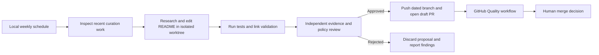

# Weekly AI Resource Curation

**Status:** Approved, revised for local execution

**Author:** Repository maintainers

**Date:** 2026-07-17, revised 2026-07-19

## Summary

Turn the repository into a weekly, evidence-backed curation system rather than a list that grows by manual submission. A local Codex desktop automation assesses topic coverage, compares current resources with credible challengers, and proposes a small README patch from an isolated worktree. An independent review vetoes weak or high-churn changes before the automation pushes a dated branch and opens a draft pull request. GitHub Actions runs deterministic quality checks, and a maintainer decides what merges. Later runs skip while a recent curation pull request awaits review.

## Goals

- Surface the absolute best resources for software developers becoming professional AI engineers.
- Cover two complementary pillars:
  - serious foundations, including classic books, papers, courses, and durable research;
  - practical AI engineering, including GenAI applications, RAG, agents, evals, security, production operations, agentic software engineering, software factories, and synchronous versus asynchronous AI systems.
- Discover important engineering topics that the repository does not yet cover.
- Evaluate incumbents and challengers, allowing additions, corrections, replacements, and removals.
- Keep weekly churn low enough that every change remains meaningful and reviewable.
- Avoid repository API-key costs by running model work through the local Codex environment.
- Make “no change this week” a successful outcome.

## Non-goals

- Build a comprehensive directory of AI products.
- Automatically merge editorial changes.
- Treat stars, social attention, or release frequency as proof of quality.
- Replace maintainer judgment for close or subjective decisions.
- React to every weekly model or product announcement.

## Constraints

- The README remains the published artifact. The system must not require a database or external content platform.
- Scheduled runs must operate unattended, stop safely on ambiguity, and defer merge approval to a maintainer.
- Research must use primary sources for factual claims and credible independent sources for adoption or production-use claims.
- Foundational material needs a durability exception. Age alone must not count against a classic paper or book.
- Practical software must be checked for maintenance, supersession, documentation, and production fitness.
- The local automation requires authenticated GitHub access and permission to create an isolated worktree, push a branch, and open a draft pull request.

## Proposed design

### Editorial model

The repository will use a version-controlled `CURATION.md` policy with two evaluation profiles.

Foundational resources will be scored on:

- technical and intellectual quality: 30%;
- durability and influence: 25%;
- value to software developers: 20%;
- authority and evidence: 15%;
- distinctiveness: 10%.

Practical resources and software will be scored on:

- technical or production quality: 25%;
- applicability to AI engineers: 20%;
- currentness and maintenance: 20%;
- real-world evidence: 20%;
- documentation and learning value: 10%;
- distinctiveness: 5%.

A resource must score at least 80 out of 100 and pass every hard gate. Hard gates reject broken, deprecated, superseded, misleading, duplicative, or unverifiable resources. A niche resource may qualify only when its narrower audience is explicit and its technical value is exceptional. Unknown evidence stays unknown and cannot be replaced by an inference from stars.

### Coverage discovery

The curator will first identify high-value developer questions missing or weakly covered in the README. It will expand each question into related terminology before searching. For example, “software factory” includes issue-to-PR agents, planner-worker-reviewer systems, isolated runners, CI feedback loops, and coding-agent orchestration. “Asynchronous AI systems” includes background agents, durable execution, job queues, event-driven workflows, checkpointing, resumption, and human approval.

If an important topic has no qualifying resource, the run reports a coverage gap and leaves the README unchanged. A weak resource must not be added merely to fill a category.

### Churn controls

Each run will:

- change no more than six resource entries;
- add no more than three net new entries;
- change no more than one foundational resource;
- avoid cosmetic rewrites, reordering, and category renaming;
- replace an incumbent only when the challenger scores at least 10 points higher or the incumbent fails a hard gate;
- leave uncertain resources unchanged;
- inspect recent curation commits and the open automation PR before proposing overlapping work.

These limits are maximums, not targets. Zero changes is valid.

### Weekly automation

The curator runs in the local Codex environment with live web research. It creates an isolated worktree from the latest `origin/master`, edits only `README.md`, and records evidence and scores. It runs the repository tests and live link validation with `--base origin/master` so the churn limits are checked deterministically. A fresh review subagent that did not perform the curation then examines the actual diff, sources, scoring, category fit, replacement margins, and churn rules. Publication requires an Approve verdict with no blocker or important findings.

Only an approved proposal is committed and pushed. The automation uses a dated `codex/curation-YYYY-MM-DD` branch and opens a draft pull request containing the evidence report, check results, and review verdict. It never merges or approves the pull request. It skips new curation work when an open Codex curation pull request exists or one was merged or closed within the last eight days. On every outcome it inspects and safely removes only the exact temporary worktree created by that run; unknown or user changes block cleanup and are reported.

### Locked prompts

The curator prompt will be stored at `.github/codex/prompts/weekly-curation.md`. It will be a short `/goal` contract that names the policy, allowed file, checks, proof, effort budget, and stop conditions. Detailed editorial judgment stays in `CURATION.md` so the prompt remains stable and reviewable.

The reviewer prompt will be stored separately. It will not trust the curator report. It will verify changed resources, scoring, evidence, category fit, and churn rules from the actual diff and sources. Any hard-gate failure, unsupported claim, or policy violation rejects the patch.

### Deterministic validation

A dependency-free Python validator will check:

- valid resource-line structure;
- HTTPS links;
- duplicate names and normalized URLs;
- required descriptions;
- empty categories;
- link status when network checking is enabled.

Definitive client errors, DNS failures, and TLS failures fail link validation. Authentication, bot protection, rate limits, timeouts, and transient server errors are warnings. Unit tests cover parsing, duplicates, category handling, URL normalization, link-status classification, and churn boundaries.

A normal pull-request workflow runs unit tests, structural validation, and live link validation. The local curator runs the same checks before publishing and also validates resource, net-addition, and foundational-change limits.

## Alternatives and tradeoffs

### GitHub Actions Codex job

This keeps model execution in repository-visible workflow logs, but requires a paid `OPENAI_API_KEY` secret and gives untrusted repository and web content a path into an API-key-bearing job. The first manual run also failed before model execution because an empty key skipped proxy startup while the action still attempted to read proxy state. Local execution avoids that secret and cost while preserving visibility through the resulting draft pull request and audit summary.

### One curator run without independent review

This costs less but makes prompt errors, weak evidence, and correlated judgment more likely to reach reviewers. Two model calls per week are justified by the repository's emphasis on quality over volume.

### A fixed number of resources per category

This makes validation simple but forces weak additions in thin categories and limits rich categories. The design uses an absolute quality threshold plus churn limits instead of a quota.

### Direct commits or automatic merging

This reduces maintenance work but removes the final editorial boundary. A review PR preserves accountability and makes rollback straightforward.

### Direct writes to the default branch

This is easier to implement but increases the impact of prompt injection or compromised repository content. The local automation instead limits curation edits to a dated branch and draft pull request, requires a fresh independent review, and leaves merging to a human.

## Risks

- **Prompt injection from web content:** Treat all external content as untrusted data, use web results only as evidence, limit repository edits to a dated README branch and draft pull request, require a fresh independent reviewer, and leave merging to a human.
- **False production-use claims:** Require independent evidence and record unknowns instead of inferring from popularity.
- **Weekly noise:** Enforce strict change budgets, comparison margins, and a no-change outcome.
- **Outdated foundational bias:** Apply separate evaluation profiles so classics are judged on durability rather than recency.
- **Worktree or branch collision:** Use an exact temporary worktree and dated curation branch, stop rather than overwrite existing or uncommitted work, and clean up the exact run-created worktree on successful, rejected, and no-change outcomes.
- **External link flakiness:** Fail only confirmed broken statuses and report blocked checks as warnings.
- **Local availability and runtime:** Run once weekly, stop after 45 minutes, and treat a missed or no-change run as safe. The next scheduled run can recover without weakening policy.

## Rollout

1. Keep the policy, prompts, schema, validator, tests, and quality workflow version controlled.
2. Configure the local Codex automation for Monday at 09:00 in the desktop timezone.
3. Run curation in an isolated worktree from the latest `origin/master`.
4. Publish only independently reviewed proposals as draft pull requests.
5. Keep the GitHub Quality workflow and human merge decision as required gates.
6. Review acceptance rate and churn after four runs.

Backout is pausing the local automation. The README and deterministic GitHub checks remain usable without it.

## Decision

Approved by the maintainer on 2026-07-17 and revised on 2026-07-19. Run the curator locally each Monday at 09:00 in the desktop timezone, require an independent review and deterministic checks, publish only a draft pull request, and never merge automatically.
