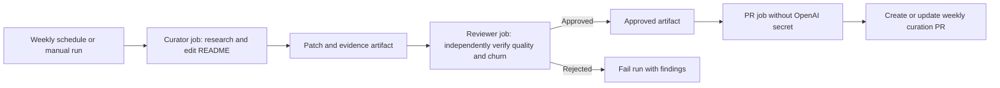

# Weekly AI Resource Curation

**Status:** Approved

**Author:** Repository maintainers

**Date:** 2026-07-17

## Summary

Turn the repository into a weekly, evidence-backed curation system rather than a list that grows by manual submission. A scheduled GitHub Actions workflow will ask Codex to assess topic coverage, compare current resources with credible challengers, and propose a small README patch. A second independent Codex run will review the evidence and veto weak or high-churn changes. Approved patches will open a dedicated automation pull request and will never merge directly into `master`. Later runs skip while that pull request awaits review.

## Goals

- Surface the absolute best resources for software developers becoming professional AI engineers.
- Cover two complementary pillars:
  - serious foundations, including classic books, papers, courses, and durable research;
  - practical AI engineering, including GenAI applications, RAG, agents, evals, security, production operations, agentic software engineering, software factories, and synchronous versus asynchronous AI systems.
- Discover important engineering topics that the repository does not yet cover.
- Evaluate incumbents and challengers, allowing additions, corrections, replacements, and removals.
- Keep weekly churn low enough that every change remains meaningful and reviewable.
- Keep the OpenAI API key isolated from jobs with GitHub write permission.
- Make “no change this week” a successful outcome.

## Non-goals

- Build a comprehensive directory of AI products.
- Automatically merge editorial changes.
- Treat stars, social attention, or release frequency as proof of quality.
- Replace maintainer judgment for close or subjective decisions.
- React to every weekly model or product announcement.

## Constraints

- The README remains the published artifact. The system must not require a database or external content platform.
- Scheduled runs must operate unattended and cannot request approvals.
- Research must use primary sources for factual claims and credible independent sources for adoption or production-use claims.
- Foundational material needs a durability exception. Age alone must not count against a classic paper or book.
- Practical software must be checked for maintenance, supersession, documentation, and production fitness.
- The workflow requires an `OPENAI_API_KEY` repository secret and permission for GitHub Actions to create pull requests.

## Proposed design

### Editorial model

The repository will use a version-controlled `CURATION.md` policy with two evaluation profiles.

Foundational resources will be scored on:

- technical and intellectual quality: 30%;
- durability and influence: 25%;
- value to software developers: 20%;
- authority and evidence: 15%;
- distinctiveness: 10%.

Practical resources and software will be scored on:

- technical or production quality: 25%;
- applicability to AI engineers: 20%;
- currentness and maintenance: 20%;
- real-world evidence: 20%;
- documentation and learning value: 10%;
- distinctiveness: 5%.

A resource must score at least 80 out of 100 and pass every hard gate. Hard gates reject broken, deprecated, superseded, misleading, duplicative, or unverifiable resources. A niche resource may qualify only when its narrower audience is explicit and its technical value is exceptional. Unknown evidence stays unknown and cannot be replaced by an inference from stars.

### Coverage discovery

The curator will first identify high-value developer questions missing or weakly covered in the README. It will expand each question into related terminology before searching. For example, “software factory” includes issue-to-PR agents, planner-worker-reviewer systems, isolated runners, CI feedback loops, and coding-agent orchestration. “Asynchronous AI systems” includes background agents, durable execution, job queues, event-driven workflows, checkpointing, resumption, and human approval.

If an important topic has no qualifying resource, the run reports a coverage gap and leaves the README unchanged. A weak resource must not be added merely to fill a category.

### Churn controls

Each run will:

- change no more than six resource entries;
- add no more than three net new entries;
- change no more than one foundational resource;
- avoid cosmetic rewrites, reordering, and category renaming;
- replace an incumbent only when the challenger scores at least 10 points higher or the incumbent fails a hard gate;
- leave uncertain resources unchanged;
- inspect recent curation commits and the open automation PR before proposing overlapping work.

These limits are maximums, not targets. Zero changes is valid.

### Weekly workflow

The curator and reviewer use `openai/codex-action@v1`. Both jobs have read-only GitHub permissions. The curator receives the `workspace-write` sandbox so it can edit the checkout, plus live web search. It outputs only a README patch and a research report. The reviewer applies the patch in a separate checkout, runs in the `read-only` sandbox with live web search, and emits structured JSON containing approval and findings.

Only an approved artifact reaches the pull-request job. That job has `contents: write` and `pull-requests: write`, but no OpenAI secret. It updates the fixed `codex/weekly-curation` branch using `--force-with-lease` and creates one review PR. The workflow skips before model execution whenever that PR is already open, preserving unreviewed work and avoiding API cost.

### Locked prompts

The curator prompt will be stored at `.github/codex/prompts/weekly-curation.md`. It will be a short `/goal` contract that names the policy, allowed file, checks, proof, effort budget, and stop conditions. Detailed editorial judgment stays in `CURATION.md` so the prompt remains stable and reviewable.

The reviewer prompt will be stored separately. It will not trust the curator report. It will verify changed resources, scoring, evidence, category fit, and churn rules from the actual diff and sources. Any hard-gate failure, unsupported claim, or policy violation rejects the patch.

### Deterministic validation

A dependency-free Python validator will check:

- valid resource-line structure;
- HTTPS links;
- duplicate names and normalized URLs;
- required descriptions;
- empty categories;
- link status when network checking is enabled.

Definitive client errors, DNS failures, and TLS failures fail link validation. Authentication, bot protection, rate limits, timeouts, and transient server errors are warnings. Unit tests cover parsing, duplicates, category handling, URL normalization, link-status classification, and churn boundaries.

A normal pull-request workflow runs unit tests, structural validation, and live link validation. The weekly curator also checks the patch against deterministic resource, net-addition, and foundational-change limits before creating an artifact.

## Alternatives and tradeoffs

### Codex desktop scheduled task

This would be simpler to start, but it depends on a local machine, creates less visible operational state, and is harder to secure and reproduce. GitHub Actions keeps the prompt, schedule, logs, patch, and PR in the repository.

### One curator run without independent review

This costs less but makes prompt errors, weak evidence, and correlated judgment more likely to reach reviewers. Two model calls per week are justified by the repository's emphasis on quality over volume.

### A fixed number of resources per category

This makes validation simple but forces weak additions in thin categories and limits rich categories. The design uses an absolute quality threshold plus churn limits instead of a quota.

### Direct commits or automatic merging

This reduces maintenance work but removes the final editorial boundary. A review PR preserves accountability and makes rollback straightforward.

### A single job with both the API key and GitHub write access

This is easier to implement but increases the impact of prompt injection or compromised repository content. Passing a patch artifact across the security boundary is safer.

## Risks

- **Prompt injection from web content:** Treat all external content as untrusted, use web results only as evidence, separate the reviewer, and keep GitHub write permissions out of AI jobs.
- **False production-use claims:** Require independent evidence and record unknowns instead of inferring from popularity.
- **Weekly noise:** Enforce strict change budgets, comparison margins, and a no-change outcome.
- **Outdated foundational bias:** Apply separate evaluation profiles so classics are judged on durability rather than recency.
- **Automation branch overwrite:** Reserve `codex/weekly-curation` for the bot and use `--force-with-lease`, never an unconditional force push.
- **External link flakiness:** Fail only confirmed broken statuses and report blocked checks as warnings.
- **API or workflow cost:** Limit each curator and reviewer to 45 minutes and three research iterations.

## Rollout

1. Add the policy, prompts, schema, validator, tests, and workflows to the current pull request.
2. Run local tests and validate the current README.
3. Add the `OPENAI_API_KEY` secret and enable GitHub Actions pull-request creation.
4. Trigger the workflow manually and inspect the first report without merging its curation PR.
5. Adjust the rubric using the first run, then enable the Monday 07:00 UTC schedule.
6. Review acceptance rate and churn after four runs.

Backout is disabling the workflow or reverting the automation commit. The README remains usable without the system.

## Decision

Approved by the maintainer on 2026-07-17. Use Monday at 07:00 UTC, allow the first manual run to propose changes under the normal limits, and document the required repository settings as setup steps.
