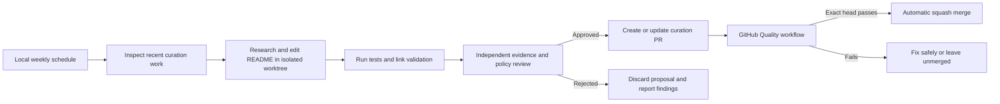

# Weekly AI Resource Curation

**Status:** Approved, revised for autonomous merging

**Author:** Repository maintainers

**Date:** 2026-07-17, revised 2026-07-27

## Summary

Turn the repository into a weekly, evidence-backed curation system rather than a list that grows by manual submission. A local Codex desktop automation assesses topic coverage, compares current resources with credible challengers, and proposes a small README patch from an isolated worktree. An independent review vetoes weak or high-churn changes before the automation creates or updates one curation pull request. GitHub Actions runs deterministic quality checks, and the automation squash-merges only when every policy, review, check, and mergeability gate passes on the exact head commit.

## Goals

- Surface the absolute best resources for software developers becoming professional AI engineers.
- Cover three complementary pillars:
  - AI foundations, including classic books, papers, courses, and durable research;
  - building AI systems, including GenAI applications, RAG, agents, evals, security, and production operations;
  - agentic software engineering, including coding-agent harnesses, agent skills, software factories, orchestration, and synchronous versus asynchronous AI systems.
- Discover important engineering topics that the repository does not yet cover.
- Evaluate incumbents and challengers, allowing additions, corrections, replacements, and removals.
- Keep weekly churn low enough that every change remains meaningful and reviewable.
- Avoid repository API-key costs by running model work through the local Codex environment.
- Remove routine maintainer merge work without weakening evidence, review, or CI gates.
- Make “no change this week” a successful outcome.

## Non-goals

- Build a comprehensive directory of AI products.
- Treat stars, social attention, or release frequency as proof of quality.
- Merge ambiguous, disputed, or weakly evidenced changes.
- Rewrite contributor branches or override maintainer decisions.
- React to every weekly model or product announcement.

## Constraints

- The README remains the published artifact. The system must not require a database or external content platform.
- Scheduled runs must operate unattended and stop safely on ambiguity.
- Research must use primary sources for factual claims and credible independent sources for adoption or production-use claims.
- Foundational material needs a durability exception. Age alone must not count against a classic paper or book.
- Practical software must be checked for maintenance, supersession, documentation, and production fitness.
- The local automation requires authenticated GitHub access and permission to create an isolated worktree, push a branch, open a ready pull request, and merge it after all gates pass.

## Proposed design

### Editorial model

The repository uses a version-controlled `CURATION.md` policy with three scope pillars and two evaluation profiles.

Foundational resources will be scored on:

- technical and intellectual quality: 30%;
- durability and influence: 25%;
- value to software developers: 20%;
- authority and evidence: 15%;
- distinctiveness: 10%.

Practical resources and software will be scored on:

- technical or production quality: 25%;
- applicability to AI engineers: 20%;
- currentness and maintenance: 20%;
- real-world evidence: 20%;
- documentation and learning value: 10%;
- distinctiveness: 5%.

A resource must score at least 80 out of 100 and pass every hard gate. Hard gates reject broken, deprecated, superseded, misleading, duplicative, or unverifiable resources. A niche resource may qualify only when its narrower audience is explicit and its technical value is exceptional. Unknown evidence stays unknown and cannot be replaced by an inference from stars.

### Coverage discovery

The curator will first identify high-value developer questions missing or weakly covered in the README. It will expand each question into related terminology before searching. For example, “software factory” includes issue-to-PR agents, planner-worker-reviewer systems, isolated runners, CI feedback loops, and coding-agent orchestration. “Asynchronous AI systems” includes background agents, durable execution, job queues, event-driven workflows, checkpointing, resumption, and human approval.

If an important topic has no qualifying resource, the run reports a coverage gap and leaves the README unchanged. A weak resource must not be added merely to fill a category.

### Churn controls

Each run will:

- change no more than six resource entries;
- add no more than three net new entries;
- change no more than one foundational resource;
- avoid cosmetic rewrites, reordering, and category renaming;
- replace an incumbent only when the challenger scores at least 10 points higher or the incumbent fails a hard gate;
- leave uncertain resources unchanged;
- inspect recent curation commits and the open automation PR before proposing overlapping work.

These limits are maximums, not targets. Zero changes is valid.

### Weekly automation

```mermaid
flowchart LR
    A["Local weekly schedule"] --> B["Inspect recent curation work"]
    B --> C["Research and edit README in isolated worktree"]
    C --> D["Run tests and link validation"]
    D --> E["Independent evidence and policy review"]
    E -->|Approved| F["Create or update curation PR"]
    E -->|Rejected| G["Discard proposal and report findings"]
    F --> H["GitHub Quality workflow"]
    H -->|Exact head passes| I["Automatic squash merge"]
    H -->|Fails| J["Fix safely or leave unmerged"]
```

The curator runs in the local Codex environment with live web research. It creates an isolated worktree from the latest `origin/master`, edits only `README.md`, and records evidence and scores. It runs the repository tests and live link validation with `--base origin/master` so the churn limits are checked deterministically. A fresh review subagent that did not perform the curation then examines the actual diff, sources, scoring, category fit, replacement margins, and churn rules. Publication requires an Approve verdict with no blocker or important findings.

Only an approved proposal is committed and pushed. The automation uses a dated `codex/curation-YYYY-MM-DD` branch and creates or updates one pull request containing the evidence report, check results, and review verdict. It may update only its own curation branch from the latest `origin/master`; it never rewrites a contributor branch.

Before merging, the automation rechecks the exact pull-request head and confirms that the pull request changes only `README.md`. Every hard gate, score, churn limit, replacement margin, local check, independent review finding, GitHub Quality check, mergeability check, and material review comment must be clear. Any head change invalidates the earlier evidence and requires a fresh review and checks. The final squash merge atomically matches the reviewed SHA with `--match-head-commit`; a mismatch stops the merge. An uncertain or failing pull request remains unmerged. Pull requests that change policy, prompts, workflows, validators, tests, or other code always require a separate non-curation review and are never auto-merged by this automation.

The automation maintains at most one automation-owned weekly pull request whose branch matches `codex/curation-*`. A merged or closed automation-owned weekly pull request starts the eight-day cooldown for new weekly proposals. Contributor resource pull requests are evaluated and may be merged independently; they do not suppress weekly curation.

On every outcome the automation inspects and safely removes only the exact temporary worktree created by that run; unknown or user changes block cleanup and are reported.

### Locked prompts

The curator prompt is stored at `.github/codex/prompts/weekly-curation.md`. It is a short `/goal` contract that delegates repository-wide operating rules to `AUTOMATION.md` and editorial judgment to `CURATION.md`, then names the allowed file, checks, proof, effort budget, and stop conditions. Keeping the detailed contracts in version control makes the scheduled prompt stable and reviewable.

The reviewer prompt will be stored separately. It will not trust the curator report. It will verify changed resources, scoring, evidence, category fit, and churn rules from the actual diff and sources. Any hard-gate failure, unsupported claim, or policy violation rejects the patch.

### Deterministic validation

A dependency-free Python validator will check:

- valid resource-line structure;
- HTTPS links;
- duplicate names and normalized URLs;
- required descriptions;
- empty categories;
- link status when network checking is enabled.

Definitive client errors, DNS failures, and TLS failures fail link validation. Authentication, bot protection, rate limits, timeouts, and transient server errors are warnings. Unit tests cover parsing, duplicates, category handling, URL normalization, link-status classification, and churn boundaries.

A normal pull-request workflow runs unit tests, structural validation, and live link validation. The local curator runs the same checks before publishing and also validates resource, net-addition, and foundational-change limits.

## Alternatives and tradeoffs

### GitHub Actions Codex job

This keeps model execution in repository-visible workflow logs, but requires a paid `OPENAI_API_KEY` secret and gives untrusted repository and web content a path into an API-key-bearing job. The first manual run also failed before model execution because an empty key skipped proxy startup while the action still attempted to read proxy state. Local execution avoids that secret and cost while preserving visibility through the resulting pull request and audit summary.

### One curator run without independent review

This costs less but makes prompt errors, weak evidence, and correlated judgment more likely to reach reviewers. Two model calls per week are justified by the repository's emphasis on quality over volume.

### A fixed number of resources per category

This makes validation simple but forces weak additions in thin categories and limits rich categories. The design uses an absolute quality threshold plus churn limits instead of a quota.

### Direct commits or merge without exact-head gates

Direct commits or unchecked merging reduce visibility and increase the impact of a bad research or review result. The selected design keeps a pull request, independent review, deterministic CI, exact-head verification, and an auditable squash commit while removing the routine manual click.

### Direct writes to the default branch

This is easier to implement but increases the impact of prompt injection or compromised repository content. The local automation instead limits curation edits to its dated branch and pull request, requires a fresh independent review, and requires successful exact-head CI before an automatic squash merge.

## Risks

- **Prompt injection from web content:** Treat all external content as untrusted data, use web results only as evidence, limit repository edits to a dated README branch and pull request, require a fresh independent reviewer, and require successful exact-head CI before merge.
- **False production-use claims:** Require independent evidence and record unknowns instead of inferring from popularity.
- **Weekly noise:** Enforce strict change budgets, comparison margins, and a no-change outcome.
- **Outdated foundational bias:** Apply separate evaluation profiles so classics are judged on durability rather than recency.
- **Worktree or branch collision:** Use an exact temporary worktree and dated curation branch, stop rather than overwrite existing or uncommitted work, and clean up the exact run-created worktree on successful, rejected, and no-change outcomes.
- **External link flakiness:** Fail only confirmed broken statuses and report blocked checks as warnings.
- **Local availability and runtime:** Run once weekly, stop after 45 minutes, and treat a missed or no-change run as safe. The next scheduled run can recover without weakening policy.

## Rollout

1. Keep the policy, prompts, schema, validator, tests, and quality workflow version controlled.
2. Configure the local Codex automation for Monday at 09:00 in the desktop timezone.
3. Run curation in an isolated worktree from the latest `origin/master`.
4. Publish only independently reviewed proposals as pull requests.
5. Require the GitHub Quality workflow on the exact head, then squash-merge qualifying proposals automatically.
6. Review acceptance rate and churn after four runs.

Backout is pausing the local automation. The README and deterministic GitHub checks remain usable without it.

## Decision

Approved by the maintainer on 2026-07-17 and revised on 2026-07-27. Run the curator locally each Monday at 09:00 in the desktop timezone, require an independent review and deterministic exact-head checks, maintain at most one automation-owned weekly curation pull request, and automatically squash-merge with an atomic head match only when every gate passes.
